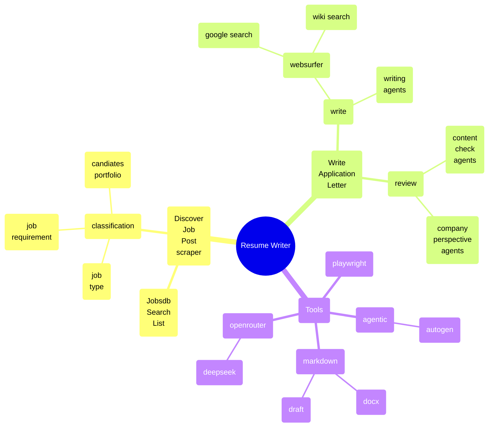
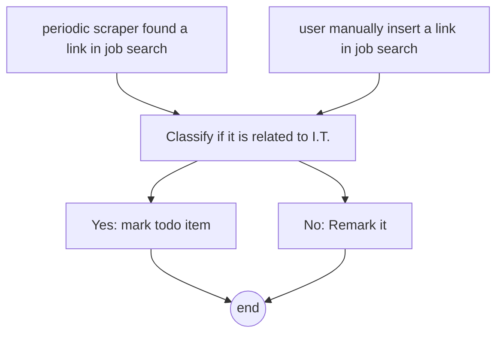
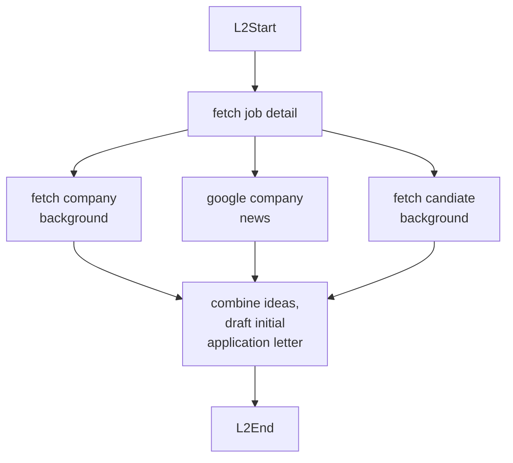

# Autogen Resume Writer

## Description/Purpose

This project leverages Autogen to help users create, analyze, and refine resumes, incorporating AI agents for automated feedback and content generation.

## Features

- **Resume Analysis**: Uses Autogen agents to provide feedback on structure, keywords, and relevance to target positions.
- **Cover Letter Generation**: Generates personalized cover letters based on resume content and job requirements.
- **Agent-Based Automation**: Integrates with OpenRouter for AI-driven suggestions and improvements.

## Project Architecture

This section includes multiple diagrams to illustrate the project architecture and flow, based on the search results.

## Diagrams

### Block diagrams

#### Idea at a glance



#### Autogen Agents Workflow



scrape job from job list flow




draft application letter flow


## Installation

### 1. Clone the repository

### 2. Set up the environment using conda

```bash
conda create -q -y -n autogen_resume_writer python=3.11
conda activate autogen_resume_writer
```

### 3. Install dependencies

```bash
pip install -r requirements.txt
```

### 4. Install additional libraries

```bash
pip install pytest-playwright
playwright install --with-deps
playwright install chrome
```

### 5. Deactivate the conda environment

```bash
conda deactivate
```

### 6. Set the `OPENROUTER_API_KEY` environment variable for API calls

## Usage

### 1. Run the main script

```bash
python main.py
```

### 2. Follow the prompts to input your resume details or job target

## Dependencies

- Python 3.11 or later
- conda
- Autogen
- OpenRouter API key (for AI services)
- Required libraries listed in `requirements.txt`

## Credits:
- [kasm project](https://github.com/kasmtech)

updated at: 2025-Jul-18
